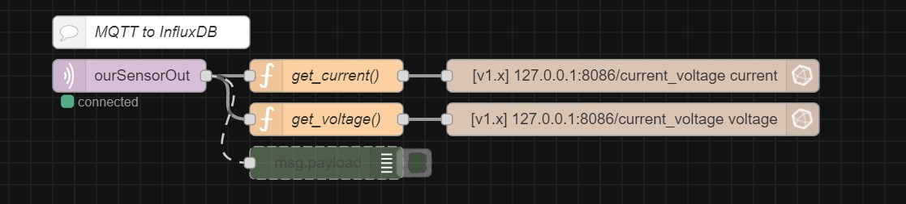
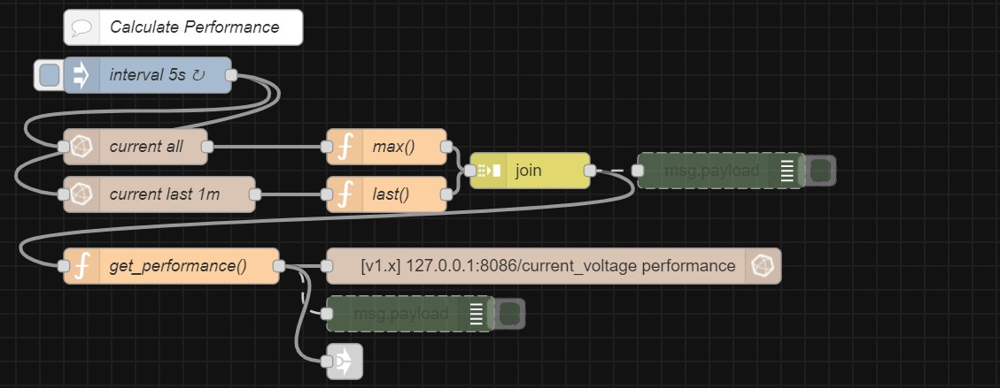
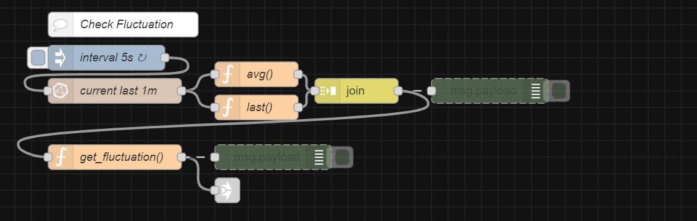
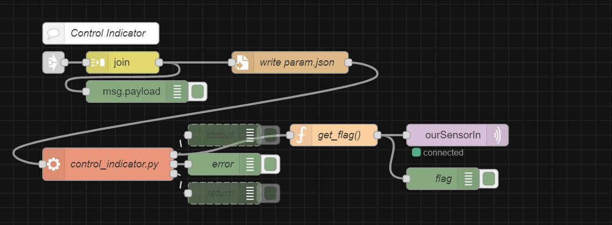
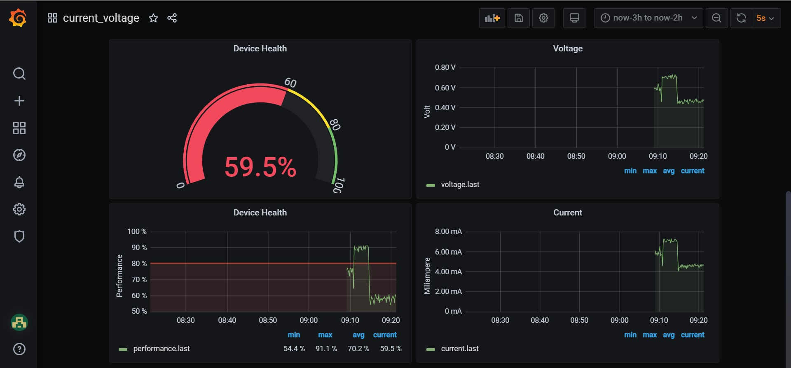

# monitoring-current-voltage
by @mahaamesha

 

## Contents 
- [About](#about)
- [Nodered](#nodered)
- [Grafana](#grafana)

 
 

## About 
**Goal**:\
Device health monitoring system by current and voltage measurement

**Purposes**:
- Create system to monitor current and voltage for general device
- Calculate device health using paramter above
- Calculate the fluctuation of parameters
- Return flag with indicator LED and email

**How it works**:
- INA219 as sensor will measure the device current and voltage
- ESP8266 will send data via MQTT protocol
- Raspi as server will receive the data from MQTT using nodered
- Data (current & voltage) will be stored in DB using influxDB
- Performance calculation:\
    We must set reference time as reference of calculation. We need value of current and voltage when device is on best condition (in new condition). Performace will be calculated by comparing current measurement with measurement in new condition. Data represented in percetage.
- Fluctuation calculation:\
    As simple as we calculate error. We measure average of data in last 1 minute. Then, compare latest data with that average. Data represented in percetage.
- Determine flag:\
    Variable `flag` will be returned to control the LED indicator. It's determined by 2 parameter: `performance_level` and `fluctuation_level`. The level is determined by limit ranges in [`limit.json`](./tmp/limit.json). Determination of `flag` using `OR` logic.

    | LED Color | flag (String) | level |
    | :-: | :-: | :-: |
    | Green | 0 | Normal |
    | Yellow | 1 | Waspada |
    | Red | 2 | Awas |
- Server will send the `flag` as `String`. Then, ESP8266 will receive it and control the indicator.
- Visualization using Grafana. Email will be send to `receiver_email` if the performance is in level 1 until 5 minutes or more.

 
 

## Nodered 
- Flow in **nodered**:
    > Backup of the flow is in [`flow.json`](./tmp/flow.json)

    
    
    
    

 
 

## Grafana 
- Visualization in **grafana**:
    > Backup of the dashboard is in [`dashboard.json`](./tmp/dashboard.json)

    

 
 

